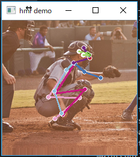

# End-to-end Recovery of Human Shape and Pose

This project is forked from https://github.com/akanazawa/hmr

Angjoo Kanazawa, Michael J. Black, David W. Jacobs, Jitendra Malik
CVPR 2018
[Project Page](https://akanazawa.github.io/hmr/)

### Requirements
- Windows 10
- Anaconda
- chocolatey
- Python 3.5
- CUDA 9.0 and cuDNN7.0

### Installation

1. Install chocolatey:  
https://chocolatey.org/install#installing-chocolatey

2. Install CUDA 9.0  
https://developer.nvidia.com/cuda-90-download-archive

3. Set up cuDNN v7.0.5 (Dec 5, 2017), for CUDA 9.0   
https://developer.nvidia.com/rdp/cudnn-archive

4. Install Anaconda  
https://www.anaconda.com/download/

5. Open command line and setup hmr
```
chocolatey install wget

# setup virtual environment
conda create -n hmr3 pip python=3.5

# install tensorflow
pip install tensorflow-gpu==1.8
# If without gpu:
# pip install tensorflow==1.8

# clone project
git clone https://github.com/furaga/hmr.git

# install packages
cd hmr
pip install -r requirements

# Download the pre-trained models
wget https://people.eecs.berkeley.edu/~kanazawa/cachedir/hmr/models.tar.gz && tar -xf models.tar.gz

# unzip pkl file converted for python3  
unzip py3-models/py3-neutral_smpl_with_cocoplus_reg.zip -d models/
```

### Run the demo
```
python -m demo --img_path data/coco1.png
```

If succeeded, a window like the followng image will pop-up

